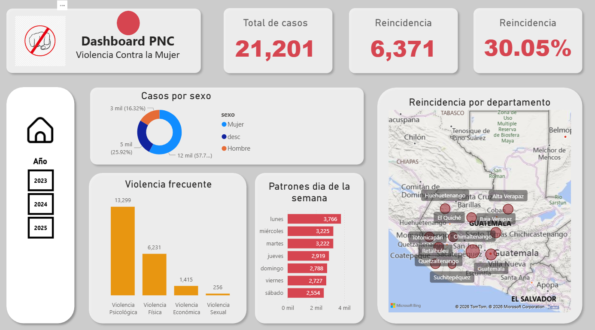
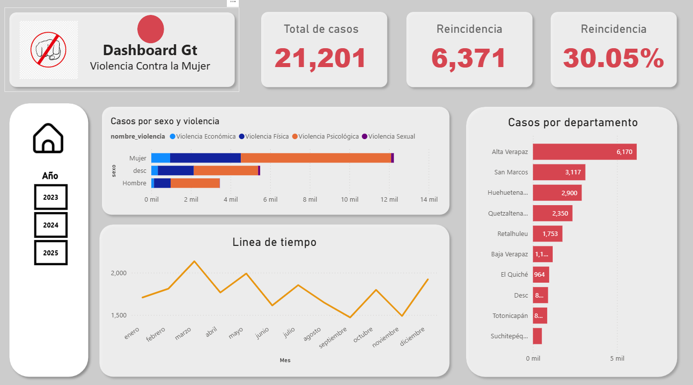

Sistema de Inteligencia de Negocios para el Análisis de casos de Violencia Contra la Mujer.

Descripción del Proyecto

Este proyecto es una solución End-to-End de Business Intelligence diseñada para centralizar, procesar y visualizar datos de incidentes de violencia. El objetivo principal es transformar datos crudos dispersos en archivos CSV en inteligencia accionable que permita identificar patrones geográficos, tendencias temporales y perfiles de reincidencia.

El proyecto destaca por su enfoque en la calidad de datos, la automatización de procesos y la validación mediante usuarios finales.

Dashboard Informe

Vista principal con KPIs.

Análisis profundo de reincidencia, perfiles demográficos y tipos de violencia.

Tecnologías y Herramientas

Base de Datos: PostgreSQL (Arquitectura multi-esquema: voriginal y vmodelada).

Lenguaje de Programación: Python (Pandas, SQLAlchemy).

Visualización: Power BI Desktop (Modelado Dimensional, DAX).

Seguridad: Dotenv para gestión de credenciales y RLS (Row-Level Security).

Automatización: Programador de Tareas de Windows / Cron.

Arquitectura de la Solución

El sistema sigue una metodología de Modelado Dimensional Estrella:

Capa de Origen: Script de ingesta de archivos CSV hacia el esquema de preparación.

Proceso ETL: Scripts de limpieza y transformación con carga incremental de dimensiones dinámicas y gestión de bitácora (log_etl).

Data Warehouse: Almacén de datos con esquema de estrella (Star Schema).

Capa de Presentación: Modelado en Power BI con medidas DAX avanzadas para el cálculo de reincidencia.

Validación de Resultados (Impacto Real)

Para validar la efectividad de la solución, se realizó una encuesta de satisfacción y utilidad a 119 usuarios finales.

Resultados clave:

91.6% de los usuarios descubrió patrones que antes eran desconocidos.

87.4% considera la información altamente relevante para sus funciones diarias.

63.8% reportó un aumento significativo en su confianza al tomar decisiones basadas en datos.

⚙️ Instalación y Configuración

Clonar el repositorio:

git clone https://github.com/melqsantiago/bi_etl_power_bi.git

Configurar entorno:
Crea un archivo .env en la raíz con las credenciales de tu base de datos:

DB_USER=tu_usuario
DB_PASSWORD=tu_password
DB_HOST=localhost
DB_PORT=5432
DB_NAME=tu_base_de_datos

Instalar dependencias:

pip install -r requirements.txt

Ejecutar ETL:

python etl/cargacp.py           carga los archivos csv al esquema original
python etl/dim_estaticas.py     se ejecutan una o rara vez
python etl/carga_diaria.py      se ejecuta diriamente

Seguridad y Privacidad

Este repositorio no contiene datos reales por razones de confidencialidad. El código está diseñado para procesar archivos CSV que sigan la estructura definida en la carpeta /data/. Se implementó Seguridad a Nivel de Fila (RLS) para restringir el acceso según el rol del usuario.

Autor

Santiago - Ingeniero Informático - in/melqui-santiago-a77536169